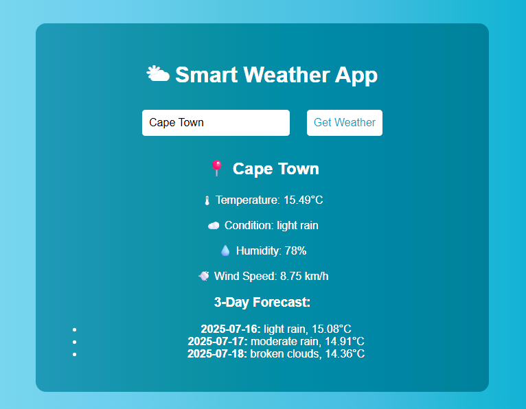

# 🌤 Smart Weather App

A modern Flask-based weather application with a clean UI, real-time weather data, and enhanced features like auto-location, dark mode, animated loader, and 3-day forecast.

---

## 🚀 Features

- 📍 Auto-detect user location via IP
- 🌡 Current temperature, condition, humidity, wind
- 📅 3-Day forecast
- 🌓 Dark/light mode toggle
- ⏳ Animated loading spinner
- 🔐 Environment-based API key using `.env`

## 🧱 Tech Stack

- **Backend**: Flask (Python)
- **Frontend**: HTML, CSS, JavaScript
- **Weather API**: [OpenWeatherMap](https://openweathermap.org/)
- **Location Detection**: [ipinfo.io](https://ipinfo.io/) or similar
- **Deployment**: Ready for deployment on platforms like **Render**, **Heroku**, or **Netlify** (via Flask API + static front)

---

---

## 📸 Screenshot



---

## 🔧 Setup Instructions

### 1. Clone the Repo

```
git clone https://github.com/Nomak25/weather-app.git
cd weather-app
```

### 2. Install requirements
```
python -m venv venv
source venv/bin/activate  # On Windows: venv\Scripts\activate
pip install -r requirements.txt
```

### 3. Create .env

API_KEY=your_api_key_here

#### 4. Run the App
```
python app.py
Then open: http//127.0.0.1:5000
```
## 💡 Inspiration

This project was inspired by the desire to create a functional and visually appealing weather app that goes beyond basic text output — combining design and usability for everyday users.

## 🤝 Contributing

Feel free to fork the project, improve it, and submit pull requests!

Ideas:

- Add hourly forecast
- Add weather alerts/warnings
- Multi-language support (i18n)
- Voice-based weather query
- Deploy with Docker

📦 Deployment Notes

- Use python-dotenv to load API keys securely
- Flask backend can be containerized or deployed via services like:
  - Render
  - Railway
  - Heroku (with buildpack adjustments)

## 🧪 Sample APIs Used

```
OpenWeatherMap API

ipinfo.io API (for IP-based geolocation)
```

## 📜 License

This project is open-source under the MIT License.

## 👤 Author

Nomanguni Khumalo
AI & Robotics Enthusiast | Tech Explorer | Builder of Beautiful Interfaces
📍 Johannesburg, South Africa
